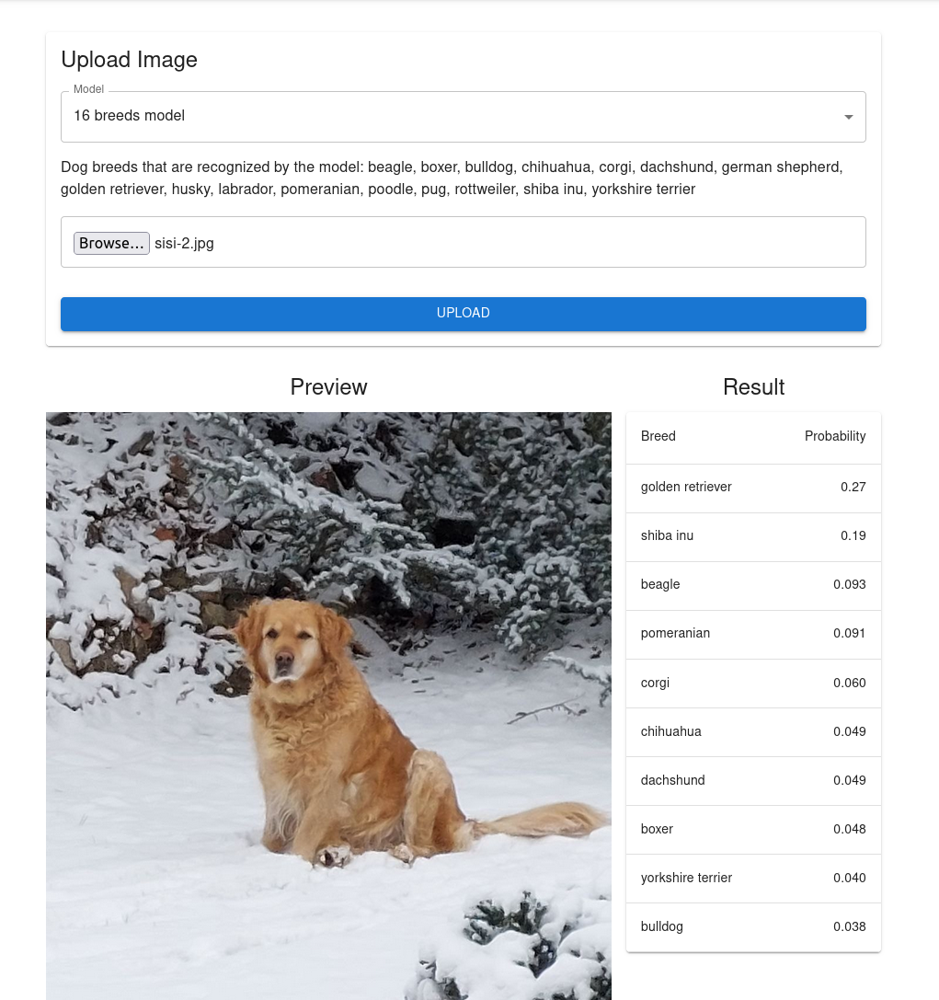

# VMM Závěrečná zpráva

**20. 10. 2024, Filip Čihák a Žaneta Trošková**

Téma: Zpracování dat s využitím neuronových sítí

## Popis projektu

V rámci projektu byla vytvořena webová aplikace pro klasifikaci psího plemene z fotografie, která využívá konvoluční neuronovou síť (Convolutional Neural Network - CNN) implementovanou pomocí frameworku Keras/TensorFlow v jazyce Python. Aplikace pak pro používá backendovou část Python framework Django a pro frontendovou část framework React s jazykem TypeScript. Uživatel tak nahraje fotografii psa a vybere model který chce k rozpoznání využit. Aplikace poté pomocí zvoleného modelu vyhodnotí plemeno, kterému je pes na fotografii vlastnostmi nejpodobnější.

## Způsob řešení
### Tvorba datasetu

Prvním krokem pro vytrénovaní funkčního modelu pomocí neuronové sítě je získání dostatečně robustního datasetu, v tomto případě tedy dostatek reprezentativních fotografií psů různých plemen anotovaných správným plemenem.

Zprvu se jevil jako vhodný dataset Stanford Dogs (dostupný [zde](http://vision.stanford.edu/aditya86/ImageNetDogs/)), rozdělený do 120 plemen, přičemž ke každému plemeni je k dispozici přibližně 150 fotografií. První experimentace ovšem ukázala, že pro vytrénování vlastní CNN s tolika třídami by bylo potřeba řádově vyšší množsví vzorků v datasetu, jelikož se dařilo model úspešně učit jen několik málo epoch a validační přesnost ve všech testovaných konfiguracích dosahovala pouze několika málo procent.

Proběhlo tak hledání dalších dat k využití pro trénování, a pro populárnější psí plemena se podařilo na platformě Kaggle najít dalších několik datasetů, konkrétně [23 Pet Breeds Image Classification](https://www.kaggle.com/datasets/aseemdandgaval/23-pet-breeds-image-classification), [The Oxford-IIIT Pet Dataset](https://www.kaggle.com/datasets/tanlikesmath/the-oxfordiiit-pet-dataset) a [70 Dog Breeds-Image Data Set](https://www.kaggle.com/datasets/gpiosenka/70-dog-breedsimage-data-set). Fotografie shodujících se plemen tak byly zkombinovány a vznikl tak dataset celkem 8 500 vzorků rozdělených poměrně rovnoměrně mezi 16 plemen oblíbených mezi majiteli psů. Na nich se již ukázalo jako možné vytvořit model splňující úkol alespoň s hrubou přesností.

### Architektura neuronové sítě

K samotné klasifikaci byla vytvořena CNN se standardní architekturou využívající nejprve posloupnost konvolučních vrstev s následným max-poolingem, následovaných plně propojenými vrstvami. Jako aktivační funkce byla použita ReLU. Poslední plně propojená vrstva pak počtem neuronů odpovídá počtu tříd, které má model klasifikovat, a využívá aktivační funkci softmax, která vrací pravděpodobnost, že vstupní vzorek patří do jednotlivých tříd. K trénování byl využit optimizační algoritmus Adam a jako loss funkce byla použita SparseCategoricalCrossentropy. 

Ve snaze o potlačení tzv. overfittingu, tedy situaci, kdy se model v trénovacích datech zafixuje na nevhodné vzory a následně se mu nedaří generalizovat na nová data, byly využity techniky augmentace dat a dropout vrstev. Augmentace dat je provedena před samotným trénováním a zahrnuje náhodné překlopení, rotaci a zvětšení vstupních fotografií. Dropout vrstvy pak náhodně vypínají některé neurony v průběhu trénování s cílem zamezit přílišné specializaci jednotlivých neuronů na trénovací data.

Dále bylo dbáno na konfigurovatelnost architektury CNN, parametrů trénování i předzpracování dat, aby bylo možné snadno experimentovat s různými konfiguracemi a zjišťovat, jak se jednotlivé změny projeví na výsledném modelu.

## Implementace

### Příprava prostředí

Jelikož je trénování neuronové sítě výpočetně náročné, je vhodné k tomuto účelu využít dedikovanou grafickou kartu (GPU), na níž lze za použití ovladačů provádět rychle paralelní výpočty využíváné mj. v machine learningu. Autoři disponují kartou AMD Radeon RX 6800, ale TensorFlow oficiálně nenabízí verzi schopnou využít GPU od AMD. Byl proto využit balíček [TensorFlow DirectML](https://learn.microsoft.com/en-us/windows/ai/directml/gpu-tensorflow-plugin) podporující všechny moderní grafické karty. Ten je ovšem postaven na starší verzi TensorFlow 2.10.0 a trénovací skript byl tedy implementován pro tuto verzi frameworku. Kromě TensorFlow je pak potřeba mít v libovolné kompatibilní verzi knihovny `numpy` a `scipy`, pro vizualizaci dat a vykreslení výsledků pak `matplotlib`.

### Skript pro trénování modelu

Pro celý proces trénování modelu byl vytvořen skript `train.py`. Ten provádí následující kroky:

1. Načtení datasetu, rozdělení na trénovací a validační množinu a augmentace dat trénovací množiny pomocí třídy ImageDataGenerator z Keras. Fotografie jsou navíc zmenšeny na požadovanou velikost pro trénování a hodnoty pixelů jsou normalizovány na interval [0, 1], který je vhodnější pro strojové učení. Skript poté vypíše informace o počtu tříd a vzorků v obou množinách.
2. Přípravné kroky: uložení seznamu tříd do souboru v pořadí odpovídajícímu indexům výstupní vrstvy modelu a případně zobrazení několika fotografií z datasetu pro kontrolu.
3. Definice modelu: pomocí třídy Sequential z Keras jsou definovány po sobě jdoucí vrstvy modelu. Dále jsou definovány pomocné callback funkce pro ukládání modelu při dosažení lepších výsledků po epoše trénování, pro zpomalení rychlosti učení pro případ, kdy se již jinak nedaří minimalizovat loss funkci, a pro zastavení trénování, pokud již model po větším počtu epoch nevykazuje zlepšení.
4. Kompilace a trénování: Model je kompilován s optimizačním algoritmem a loss funkcí popsanou výše a je zahájeno trénování tak, že framework vypisuje průběh epoch, jejich výsledky (tedy dosaženou hodnotu loss funkce a přesnost modelu jak v trénovácí, tak validační fázi) a aktivaci výše definovaných callback funkcí v rámci trénování. Na konci trénování jsou tyto informace případně vykresleny do grafu.

Skript je napsán tak, že veškeré konfigurace se provádí nastavením konstant na začátku souboru. Dataset je koncipován tak, že v uvedené složce se očekává jedna podsložka pro každou klasifikační třídu, která obsahuje všechny fotografie do ní spadající. Složka pro uložení modelu pouze musí existovat a je do ní uložen výsledný model a seznam tříd. Ostatní parametry jsou číselné a je možné je měnit dle potřeby. Dále se předáním argumentu plot při spouštění skriptu (tedy např. `python train.py plot`) vyvolá vykreslení vzorku dat a po skončení graf průběhu učení.

### Webová aplikace

#### Instalace a spuštění webové aplikace

Pro spuštění backend části webové aplikace je potřeba mít nainstalovaný Python (3.8.10) a doinstalovat framework Django a další potřebné knihovny (Numpy, TensorFlow, Django REST framework, Pillow). Spuštění backend části aplikace se provede příkazem `python manage.py runserver`.

Pro spuštění frontend části webové aplikace je potřeba mít nainstalovaný Node.js (18 a vyšší) a doinstalovat React a další potřebné knihovny příkazem `npm install`. Následné spuštění frontend části aplikace se provede příkazem `npm start`. Aplikace bude dostupná na adrese `http://localhost:3000`.

Po spuštění aplikace se objeví formulář, kde má uživatel možnost nahrát obrázek psa a pole s vybráním modelu, který bude použit na rozpoznání plemene (viz následující sekce).

Po vybrání konkrétního modelu se uživateli zobrazí seznam plemen, které model rozpoznává.
Po stisknutí tlačítka "Upload" se provede predikce pomocí zvoleného modelu a uživateli se zobrazí tabulka s 10 nejpravděpodobnějšími plemeny, ke kterým pes na obrázku patří, seřazenými sestupně podle pravděpodobnosti.

#### Ukázka aplikace

Na obrázku je vidět ukázka webové aplikace, kde byl nahrán obrázek psa a vybrán model 16 Breeds Model. Aplikace vrátila tabulku s 10 nejpravděpodobnějšími plemeny psů, které by mohlo být na obrázku. Aplikace správně určila, že na obrázku je pes plemene Golden Retriever (i když jen s pravděpodobností 27 %).

## Experimentace

Výkon neuronové sítě závisí na mnoha parametrech, které je potřeba vhodně zvolit. V rámci projektu bylo postupně provedeno několik experimentů, které se zabývali jejich nastavením a vlivem na výsledky. Těmi je v tomto případě chápána zejména dosažená validační přesnost trénovaného modelu, tedy údaj, jak dobře model přiřazuje vzorkům z validační množiny dat správné označení třídy (tedy plemene psa na obrázku). Sekundárně bude sledována velikost neuronové sítě, která negativně ovlivňuje dobu trénování i velikost výstupního souboru s připraveným modelem.

Kde není popsáno jinak, probíhalo trénování na datasetu 16 plemen psů popsaném v sekci Tvorba datasetu.

Následující parametry a volby byly po pilotní experimentaci (popsáno u každého parametru) udržovány konstantní, a to s těmito hodnotami:

- Podíl validační množiny datasetu (`VALIDATION_RATIO`): 0.2; určuje, jaká část datasetu bude vyčleněna do validační množiny, a jaká zbyde pro trénování. Jedná se o obecně doporučenou hodnotu, základní experimentování navíc ukázalo, že drobnější změny (+- 0.05) v rozdělení neměly významný vliv na výsledky, větší změny pak měly tendenci výsledek zhoršovat.
- Velikost dávky (`BATCH_SIZE`): 32; určuje, kolik vstupů (obrázků) je v rámci trénování zpracováváno najednou. Opět se jedná o standardní hodnotu, změny hodnoty neprokázaly významný vliv na výsledky.
- Míra v dropout vrstvě (`DROPOUT_RATE`): 0.2; určuje, jaký podíl neuronů je deaktivován v rámci dropout vrstev modelu (viz Architektura neuronové sítě). Při použití jedné dropout vrstvy se ukázala tato míra jako rozumná, aby měl dropout měřitelný vliv, ale zároveň nezabraňoval učení neuronové sítě.
- Míra učení (`LEARNING_RATE` a `PATIENCE_EPOCHS_REDUCE_LR`): 0.002 a 3; určuje, jako mírou se optimizační algoritmus snaží minimalizovat loss funkci (a tedy vylepšovat model). Při vyšší hodnotě se zvyšuje pravděpodobnost skokových zlepšení, ale také stagnace učení. Jelikož byl implementován callback automaticky snižující tuto hodnotu (viz Architektura neuronové sítě), je lepší počátečně volit větší míru, jelikož dojde k jejímu automatickému snížení v případě, kdy se nedaří loss funkci minimalizovat po počet epoch stanovených parametrem patience.
- Nastavení limitu epoch (`MAX_EPOCHS` a `PATIENCE_EPOCHS_STOP`): 10000 a 8; celkový horní limit epoch trénování a počet epoch, po kterém se trénování ukončí, pokud nebylo dosáhnuto zlepšení. Byly voleny vyšší hodnoty, jelikož byl průběh trénování sledován a mohl být tak uživatelsky ukončen, pokud se již zjevně model nezplepšoval.

### Podpůrný experiment: velikost obrázků

Fotografie v sestaveném datasetu patrně pochází z mnoha zdrojů a mají tak různé velikosti. Pro trénování CNN je ovšem nutné, aby měly všechny vstupy stejnou velikost, přičemž je typicky volena velikost čtvercová. Otázkou tedy je, na jakou velikost fotografie v datasetu přeškálovat. Větší velikost vstupů umožňuje síti rozpoznat jemnější detaily, ovšem logicky zvětšuje i neuronovou síť a na některé úkoly se ukázaly jako dostačující i menší velikosti vstupů. Jeden z dílčích datasetů již má fotografie náškálované na velikost 224x224 pixelů a další fotografie mají také podobné rozměry, proto škálovat na větší než tuto velikost nedává smysl.

Následující tabulka ukazuje vliv velikosti obrázků na výsledný model. V tomto experimentu byla volena konstantní konfigurace vrstev neuronové sítě, podobná vzorové konfiguraci v dokumentaci TensorFlow pro klasifikaci obrázků (dostupné [zde](https://www.tensorflow.org/tutorials/images/classification)). Do ní byla přidána další plně propojená vrstva s 64 neurony, jelikož v dokumentaci je řešen relativně jednodušší úkol - klasifikace 5 druhů květin.

| Velikost obrázků | Validační přesnost | Velikost modelu | Délka epochy trénování |
|---|--:|--:|--:|
| 64x64 | 0.382 | 6.43 MiB | ~ 22 s |
| 160x160 | 0.399 | 37.9 MiB | ~ 32 s |
| 224x224 | 0.417 | 73.9 MiB | ~ 45 s |

Výsledkem bylo rozhodnuto, že se dále bude pracovat s velikostí obrázků 160x160, jelikož se jeví jako vhodný kompromis mezi kvalitou a náročností modelu. Dá se navíc předpokládat, že pro složitější sítě by mohl větší rozměr vstupu zajistit větší zlepšení, jelikož se bude model schopný učit i na menších detailech.

### Konfigurace vrstev sítě

Posledním, ovšem podstatným, krokem v konfiguraci je zvolení samotných vrstev neuronové sítě. Jak již bylo zmíněno výše, projekt se bude držet standardní architektury CNN vykládané na přednášce i používáné v dokumentaci TensorFlow. U konvolučních vrstev bude vždy použita velikost filtru 3x3, která je opět znázorněna na přednášce a nejčastěji používána v praxi v moderních CNN. Stále ovšem zbývá zvolit jak počet konvolučních vrstev, tak plně propojených vrstev kromě poslední klasifikační (nazývaných skryté vrstvy). U nich je dále potřeba volit počet filtrů, resp. počet neuronů, v případě konvoluční, resp. skryté vrstvy. Opět platí, že vyšší hodnoty mohou zvýšit kvalitu neuronové sítě, ovšem zvětšují její velikost.

Tento experiment byl kromě celého datasetu proveden také na redukované sadě, která obsahuje pouze polovinu plemen. Následující tabulky znázorňují výsledky experimentu (zkratka Do v popisu skrytých vrstev značí zařazení dropout vrstvy):

Dataset 16 plemen (beagle, boxer, bulldog, chihuahua, corgi, dachshund, german_shepherd, golden_retriever, husky, labrador, pomeranian, poodle, pug, rottweiler, shiba_inu, yorkshire_terrier):

| Velikost obrázků | Konvoluční vrstvy (počty filtrů) | Skryté vrstvy (počty neuronů) | Validační přesnost | Uloženo jako |
|--|--|--|--:|---|
| 160x160 | 16-32-32 | Do-32 | 0.337 |  |
| 160x160 | 16-32-64 | Do-128-64 | 0.399 |  |
| 160x160 | 16-32-32-64 | Do-64-32 | 0.422 |  |
| 160x160 | 16-32-32-64-64 | Do-64-32 | 0.088 |  |
| 160x160 | 16-32-32-64 | Do-128-64-Do-32 | 0.440 |  |
| 160x160 | 32-64-64-128 | Do-128-64-Do-32 | 0.502 |  |
| 160x160 | 32-64-64-128 | Do-64-32 | 0.448 |  |
| 160x160 | 64-128-128-256 | Do-128-64-Do-32 | 0.450 |  |
| 160x160 | 64-128-256 | Do-128-64-Do-32 | 0.561 | 16_dogs_v1 |
| 160x160 | 64-128-256 | Do-128-96-64-Do-32 | 0.401 |  |

Vidíme, že počet neuronů zvolený v prvních testech se ukázal jako příliš malý a model se podařilo zpřesnit přidáním více skrytých vrstev s více neurony. V posledním testu naopak bylo již zřejmě použito skrytých vrstev příliš mnoho a model měl i po vyšším počtu epoch problém dosáhnout stejné přesnosti jako u jednodušších variant. Také bylo zjišteno, že při použití 5 konvolučních vrstev se modelu nedařilo učit vůbec, proto byly dále testovány konfigurace s 3 až 4 konvolučními vrstvami. 

Dataset 8 plemen (beagle, boxer, golden_retriever, husky, poodle, pug, rottweiler, yorkshire_terrier):

| Velikost obrázků | Konvoluční vrstvy (počty filtrů) | Skryté vrstvy (počty neuronů) | Validační přesnost | Uloženo jako |
|--|--|--|--:|---|
| 160x160 | 16-32-32 | Do-32 | 0.565 |  |
| 160x160 | 16-32-32 | Do-64-32 | 0.576 |  |
| 160x160 | 32-64-128 | Do-64-32 | 0.580 |  |
| 160x160 | 16-32-32 | Do-128-96 | 0.550 |  |
| 160x160 | 16-32-32 | Do-16 | 0.395 |  |
| 224x224 | 16-32-32 | Do-64-32 | 0.567 |  |
| 160x160 | 16-32-32 | Do-30-18-12 | 0.470 |  |
| 160x160 | 32-32-64-64 | Do-64-32 | 0.611 |  |
| 160x160 | 64-128-128-256 | Do-64-32 | 0.622 | 8_dogs_v3 |
| 160x160 | 64-128-128-256 | Do-128-64-Do-32 | 0.543 |  |

U jednoduššího datasetu naopak lepších výsledků dosahovaly konfigurace s méně neurony, což dává smysl, jelikož zde byly více jasné rozdíly mezi třídami (plemeny) a jednalo se tak o lehčí úkol. Nejlepších výsledků pak bylo dosaženo aplikováním vyššího množství filtrů v konvolučních vrstvách.

Příslušně označené modely byly uloženy a jsou pod danými jmény k dispozici ve výsledné aplikace. Výsledkům tohoto experimentu se věnuje sekce Diskuse.

### Transfer learning

V rámci experimentace bylo také provedeno trénování modelu pomocí metody transfer learningu. Jako základ byl použit model předtrénovaný MobileNetV2 na datasetu ImageNet. 

Modelu byly přidány navíc nové vrstvy:
- (Dense) skrytá vrstva se 128 neurony a aktivační funkcí ReLU
- Klasifikační vrstva s počtem neuronů odpovídajícím počtu tříd (n_classes)
Nově vzniklému modelu bylo vypnuto trénování všech vrstev pocházející z MobileNetV2, tedy byly trénovány pouze nově přidané vrstvy.

Výsledný model byl následně trénován na datasetu 16 plemen psů. Jeho výsledná validační přesnost činila 0.899.

## Diskuse

Z výsledků je relativně dobře patrné, jak přibližně musí být neuronová síť minimálně složitá, aby byla schopná pojmout úkol klasifikace psích plemen pro daný dataset. U jednoduchých sítí z výše testovaných docházelo k zastavení učení po několika epochách, což naznačuje nedostatečnou velikost sítě, a promítlo se na horších výsledcích v desítkách procentních bodů oproti složitější konfiguraci. Naopak bylo pro oba datasety vypozorováno, v jakém bodě má přidávání více vrstev a neuronů negativní vliv na přesnost.

Další ladění sítě a získávání konzistentních výsledků se ovšem ukázalo jako velice náročný úkol, jelikož proces trénování jako takový je nedeterministický. I na tomto na relativně malém datasetu se navíc ukázala vysoká náročnost této metody, jelikož i při použití na současné poměry výkonného počítače s herní grafickou kartou trvalo trénování výše uvedených modelů desítky minut. Počet běhů tak musel být omezen na jednotky.

V průběhu učení byl navíc i přes snahu o jeho minimalizaci patrný overfitting zabraňující dalšímu zvýšení validační přesnosti modelů. Pro jeho eliminaci a zlepšení výsledků by tak patrně bylo potřeba dále zvětšovat dataset, což by kromě času na sestavení znamenalo i ještě větší náročnost trénování sítě. Jako vhodná se tak ukázala v tomto "amatérském" prostředí metoda transfer learningu, kde model připravený na širokou škálu dat lze úzce specializovat pro úkol rozpoznání psích plemen i s menším datasetem.

## Závěr

V rámci projektu byla vyvinuta webová aplikace pro klasifikaci psích plemen z obrázků pomocí neuronových sítí. Byly vytrénovány dva modely od základu (jeden pro 8 plemen a druhý pro 16 plemen). Dále byl vytrénován jeden model pomocí metody transfer learningu rozpoznávající 16 plemen. Modely trénované od základu dosáhly nejvyšší validační přesnosti 0.622 (pro 8 plemen) a 0.561 (pro 16 plemen). Model trénovaný pomocí transfer learningu dosáhl výrazně vyšší validační přesnosti, konkrétně 0.899. Všechny tři modely jsou v aplikaci dostupné a je možné pomocí nich predikovat podobnost jednotlivým plemenům na dodané fotografii psa.

